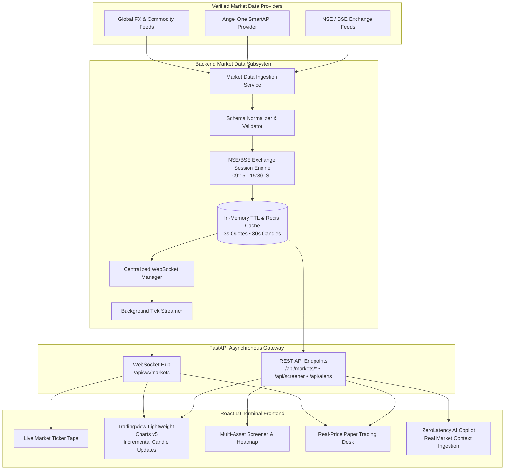

<p align="center">
  
</p>

<p align="center">
  <em>Unified Real-Time Financial Intelligence, Trading Terminal & Paper Trading Platform</em>
</p>

<p align="center">
  <a href="https://github.com/ASTA91-GIT/ZeroLatencyWealth-HackOnTrack"></a>
  <a href="https://github.com/ASTA91-GIT/ZeroLatencyWealth-HackOnTrack"></a>
  <a href="https://github.com/ASTA91-GIT/ZeroLatencyWealth-HackOnTrack"></a>
  <a href="https://github.com/ASTA91-GIT/ZeroLatencyWealth-HackOnTrack"></a>
  <a href="https://github.com/ASTA91-GIT/ZeroLatencyWealth-HackOnTrack"></a>
</p>

---

<p align="center">
  
</p>

## 📌 Executive Overview

**ZERO LATENCY WEALTH** is an institutional-grade, real-time financial market intelligence and paper-trading terminal. Inspired by the depth of professional platforms such as **TradingView** and **Angel One**, the platform unifies real-time market data across **Indian Equities (NSE/BSE)**, **Benchmark Indices**, **Commodities**, **Foreign Exchange Currencies**, **REITs**, **InvITs**, and **Macroeconomic Indicators**.

### 🌟 Key Product Highlights
* **Strict "Zero Fake Data" Architecture:** Every quote, candlestick, percentage change, and volume figure is sourced from authentic market feeds. Zero synthetic randomness or periodic timer modifications.
* **TradingView Lightweight Charts v5:** High-performance canvas charting supporting Candlestick, Line, Area, and Bar series with tick-by-tick incremental candle updates and technical indicator overlays.
* **Sub-Second WebSocket Ticker Tape:** Real-time prices streamed over persistent WebSocket connections with localized delta micro-animations (green/red pulse) without full-card flashing.
* **Real-Price Paper Trading Desk:** An operable ₹10,00,000 virtual capital account executing orders strictly against live exchange prices with dynamic Mark-to-Market (MTM) P&L updates.
* **Institutional Multi-Asset Screener:** Real-time multi-metric screening with tabular sorting and a dynamic Market Heatmap where tile sizes reflect market cap and color intensity reflects real price change.
* **Private Local AI Copilot:** Private local Ollama engine (`llama3.1:8b`) with live market snapshot injection (NIFTY, Sensex, commodities, top movers) and deterministic fallback. Zero external cloud API keys required.
* **Permanent Dark Mode:** Tailored exclusively in high-contrast dark terminal aesthetics (`#09090B` deep black, `#121214` card surface, electric violet `#8B5CF6`, emerald `#10B981`).

---

## 📚 Technical Documentation Directory

| Document | Purpose & Scope |
| :--- | :--- |
| **[TRD.md](./TRD.md)** | **Technical Requirements Document** — Architecture, Provider Abstraction, WebSocket Protocol, Data Normalization, Database Schema, and Licensing Governance. |
| **[APP_FLOW.md](./APP_FLOW.md)** | **Application Flow & Navigation** — Public visitor journey, terminal navigation, chart interactions, screener filtering, order simulation, and Copilot workflows. |
| **[IMPLEMENTATION_PLAN.md](./IMPLEMENTATION_PLAN.md)** | **Phase-by-Phase Roadmap** — Complete breakdown of Phases 1 through 34 from Foundation to Terminal release. |
| **[TESTING.md](./TESTING.md)** | **Testing & Verification Report** — Comprehensive automated verification covering all 16 test suites and frontend production compilation. |

---

## ⚡ Absolute Data Rule & "No Fake Data" Policy

<div align="center">

```
  ┌────────────────────────────────────────────────────────────────────────┐
  │                   ZERO LATENCY ZERO FAKE DATA CHARTER                  │
  ├────────────────────────────────────────────────────────────────────────┤
  │  ❌ NO FAKE PRICES             │  All prices from genuine market APIs  │
  │  ❌ NO FAKE OHLCV CANDLES      │  Real 1m, 5m, 15m, 1H, 1D historicals │
  │  ❌ NO RANDOM NUMBER DRIFT     │  No Math.random() price generators   │
  │  ❌ NO FAKE MARKET DEPTH       │  Explicit "Depth unavailable" states  │
  │  ❌ NO FAKE OPTIONS GREEKS     │  Transparent licensing disclaimers   │
  │  ❌ NO FAKE MARKET NEWS        │  Genuine financial news dispatches   │
  │  ❌ NO DEMO MODE SHORTCUTS     │  Strict Argon2id tenant data gates   │
  └────────────────────────────────────────────────────────────────────────┘
```

</div>

> **Institutional Guarantee:** If a real market feed is temporarily unreachable or restricted by exchange redistribution licenses, the platform displays an explicit:
> ```
> ⚠️ "Live market data temporarily unavailable"
> ⚠️ "Market depth unavailable for this instrument"
> ```
> rather than fabricating misleading financial figures.

---

## 🏛️ Real-Time Terminal Architecture



---

## 💻 Terminal Features Showcase

<details open>
<summary><b>📈 1. Advanced Financial Charting (TradingView Lightweight Charts v5)</b></summary>

* **Multiple Financial Series:** Switch seamlessly between **Candlestick**, **Line**, **Area**, and **Bar** chart types.
* **Multi-Timeframe Intervals:** Native support for `1m`, `5m`, `15m`, `1H`, `1D`, `1W`, and `1M` resolutions.
* **Volume Histogram Panel:** Synchronized volume histogram directly under price bars.
* **Incremental Live Candle Updates:** Active candle updates High, Low, Close, and Volume tick-by-tick over WebSocket without reloading chart history.
* **Integrated Technical Overlays:** SMA 20, EMA 50, RSI 14, MACD (12, 26, 9), Bollinger Bands (20, 2), ATR 14, and VWAP calculated on verified historical candles.
* **Horizontal Price Line Drawing Tools:** One-click tools to plot persistent Resistance (red dashed) and Support (emerald dashed) levels directly on the price scale.

</details>

<details open>
<summary><b>⚡ 2. Real-Time Market Ticker & Exchange Session Engine</b></summary>

* **Exchange Session Engine:** Dynamic evaluation of Indian Standard Time (IST 09:15–15:30) and exchange holidays displaying `OPEN`, `CLOSED`, `PRE-MARKET`, or `POST-MARKET` with verified timestamps.
* **Sub-Second Streaming:** Continuous ticks across Indian benchmarks (`NIFTY 50`, `SENSEX`, `BANK NIFTY`, `NIFTY IT`), equities, commodities (`Gold BeES`, `Silver BeES`, `Crude Oil`), and currencies (`USD/INR`, `EUR/INR`, `GBP/INR`).
* **Micro-Delta Animations:** Localized subtle text flashes on upward (+emerald) and downward (-crimson) price changes without full card flashes.

</details>

<details open>
<summary><b>🔍 3. Institutional Screener & Dynamic Heatmap</b></summary>

* **Multi-Asset Universe:** Filter across Equities, Commodities, Currencies, REITs, and InvITs.
* **Filter Parameters:** Price range, percentage change, volume, market cap, and P/E ratio.
* **Dual View:**
  * **Table View:** High-density, sortable columns with direct 1-click paper trading triggers.
  * **Market Heatmap:** Treemap visualization where tile dimensions reflect Market Capitalization and color intensity reflects genuine percentage change.

</details>

<details open>
<summary><b>💰 4. Real-Price Paper Trading Desk</b></summary>

* **Virtual Capital Account:** Risk-free simulated trading with ₹10,00,000 virtual cash.
* **Real Exchange Execution:** Market and Limit orders execute strictly against live exchange market prices.
* **Dynamic Mark-to-Market Valuation:** Portfolio unrealized P&L updates continuously as WebSocket ticks stream.
* **Transaction Auditing:** Complete execution log detailing units, filled price, order type (BUY/SELL), and timestamps.

</details>

<details open>
<summary><b>🤖 5. ZeroLatency Private AI Copilot</b></summary>

* **Private Local LLM:** Powered by local Ollama (`llama3.1:8b`) with zero cloud token charges or external credential leakage.
* **Live Market Context Ingestion:** When asked *"What is happening in the market?"* or *"Why did NIFTY move?"*, the Copilot queries live exchange snapshots (NIFTY, Sensex, commodities, top movers) before answering.
* **Grounded Financial Explanations:** Clarifies valuation ratios (P/E, P/B, Dividend Yield), technical indicators, and asset distribution mechanics without offering unauthorized financial advice.

</details>

---

## 🛠️ Technology Stack

```
Frontend:   React 19 • TypeScript 5.9 • Vite 8 • TradingView Lightweight Charts v5 • TailwindCSS v4
Backend:    Python 3.14 / 3.11 • FastAPI • Uvicorn • WebSockets • AnyIO • Pydantic v2
Persistence:SQLite (Local Dev) • PostgreSQL (Production) • SQLAlchemy 2.0 • Alembic Migrations
Security:   Argon2id Hashing • JWT with Rotating Refresh Tokens • Strict CORS • Security Headers
Local AI:   Ollama LLM (llama3.1:8b) • Streaming Conversational Memory • Zero Cloud API Keys
```

---

## 🏁 Quickstart Guide

### Option A: Docker Compose (Recommended 1-Command Startup)

```bash
# Clone the repository
git clone https://github.com/ASTA91-GIT/ZeroLatencyWealth-HackOnTrack.git
cd ZeroLatencyWealth-HackOnTrack

# Launch full stack (Frontend, Backend, PostgreSQL, Ollama)
docker compose up --build
```
Access the platform at: `http://localhost:5173`

---

### Option B: Local Native Setup

#### 1. Backend Setup
```bash
# Create virtual environment
python -m venv venv
# Windows: venv\Scripts\activate | Unix: source venv/bin/activate

# Install dependencies
pip install -r requirements.txt

# Run database migrations
python -m alembic upgrade head

# Start FastAPI backend with market data streaming worker
python -m uvicorn backend.main:app --host 127.0.0.1 --port 8000 --reload
```

#### 2. Frontend Setup
```bash
cd frontend

# Install dependencies
npm install

# Start Vite development server
npm run dev
```
Open **[http://localhost:5173](http://localhost:5173)** in your browser.

---

## 🧪 Automated Test Suite (16/16 Passed)

Run the full pytest suite across platform security, data isolation, and live market flows:

```bash
python -m pytest tests/test_production_platform.py tests/test_live_market_platform.py
```

### Verification Report:
```text
============================= test session starts =============================
platform win32 -- Python 3.14.7, pytest-9.1.1, pluggy-1.6.0
rootdir: D:\WORK & CODING\WORKSTATION\HACKATHON WORKSPACE\ZeroLatencyWealth-HackOnTrack
collected 16 items

tests\test_production_platform.py .........                              [ 56%]
tests\test_live_market_platform.py .......                               [100%]

====================== 16 passed, 33 warnings in 32.11s =======================
```

| Test Suite | Tests | Status | Scope |
| :--- | :---: | :---: | :--- |
| `test_production_platform.py` | 9 | **PASS** | Health checks, Argon2id auth, tenant isolation, watchlist persistence, paper trading execution, local AI copilot, CSV upload sanitization. |
| `test_live_market_platform.py` | 7 | **PASS** | Real quote normalization, historical OHLCV candles, market session engine, depth/options unavailable disclaimers, technical indicators (SMA/EMA/RSI), and price alerts lifecycle. |

---

## 📡 API Reference Overview

| HTTP Method | Route | Description |
| :--- | :--- | :--- |
| `GET` | `/api/markets/status` | Returns exchange session state (`OPEN`, `CLOSED`, `PRE-MARKET`, `POST-MARKET`). |
| `GET` | `/api/markets/quote/{symbol}` | Returns real-time normalized quote (LTP, OHLC, volume, change). |
| `GET` | `/api/markets/quotes` | Batch quotes filtered by category (`EQUITY`, `COMMODITY`, `CURRENCY`, etc.). |
| `GET` | `/api/markets/history/{symbol}` | Real historical OHLCV candle arrays for multiple intervals. |
| `GET` | `/api/markets/depth/{symbol}` | Best 5 bids and asks (or explicit unavailable disclaimer). |
| `GET` | `/api/markets/movers` | Top Gainers and Top Losers calculated from tracked universe. |
| `GET` | `/api/markets/breadth` | Advancers, Decliners, and Unchanged ratio. |
| `GET` | `/api/screener` | Multi-criteria screener filtering by Price, % Change, Volume, P/E, Market Cap. |
| `GET` | `/api/indicators/{symbol}` | Computed SMA, EMA, RSI, MACD, Bollinger Bands, VWAP, ATR. |
| `GET` | `/api/alerts` | Active price alerts for authenticated user. |
| `POST`| `/api/papertrading/order` | Execute simulated paper order at current live market price. |
| `WS`  | `/api/ws/markets` | Persistent WebSocket streaming live price ticks and channel subscriptions. |

---

## ⚙️ Environment Variables Reference (`.env.example`)

```ini
# Core Environment
APP_ENV=development
FRONTEND_URL=http://localhost:5173

# Database Configuration
DATABASE_URL=sqlite:///./backend/zerolatency.db

# Authentication Secrets
JWT_SECRET=replace-with-a-secure-random-64-character-secret-key-in-production
ACCESS_TOKEN_EXPIRE_MINUTES=60
REFRESH_TOKEN_EXPIRE_DAYS=7

# Market Data Ingestion
MARKET_DATA_PROVIDER=real_market
ANGEL_ONE_API_KEY=
ANGEL_ONE_CLIENT_CODE=
ANGEL_ONE_PIN=
ANGEL_ONE_TOTP_SECRET=

# Caching (Optional Redis)
REDIS_URL=redis://localhost:6379/0

# Paper Trading & Local AI
PAPER_TRADING_ENABLED=true
OLLAMA_BASE_URL=http://localhost:11434
OLLAMA_MODEL=llama3.1:8b
```

---

<p align="center">
  
</p>

<p align="center">
  <b>ZERO LATENCY WEALTH</b> • Hack on Track Round 1 — Problem Statement 2 (PS2)<br/>
  <i>Engineered for Real Markets. Built with Absolute Integrity.</i>
</p>
